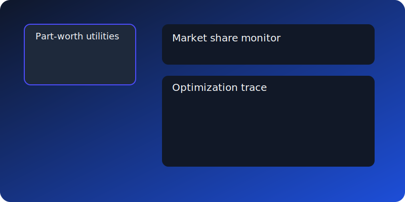

# Pilk-DCE WebUI

A sleek, professional dark-themed dashboard for the Pilk-DCE CLI toolkit.



## Highlights

- **Multi-page experience**: Generator, Analyzer, Visualizer, Designer, Export, and a polished Home page.
- **Modern stack**: Streamlit for interactivity, Altair/Plotly for charts, Pandas for processing.
- **Interactive analytics**: Drag-and-drop uploads, side-by-side MNL vs Mixed Logit comparison, Bayesian prior visualizer, and sample-size efficiency tools.
- **Visualization suite**: Part-worth bars, WTP with confidence intervals, market share slider, prediction variance heat maps, leverage distributions, efficiency trace plots, and optimization comparison bars.
- **Data portability**: CSV/JSON/ZIP export buttons, downloadable example configs, and sample response datasets.
- **Session persistence**: All pages respect Streamlit session state to keep data across navigation.

## Quick Start (Local)

```bash
pip install -r requirements.txt
streamlit run pilk_dce/webui/app.py
```

- Upload your YAML config (or use the example in `pilk_dce/webui/data/examples`).
- Navigate through Generator → Analyzer → Visualizer → Designer → Export to complete the workflow.
- Use the Designer page to craft attributes with live YAML previews and a Bayesian prior chart.

## Deployment

### Streamlit Cloud

1. Push the repository to GitHub if not already hosted.
2. Connect the `pilk-dce` project to Streamlit Cloud and set the main script to `pilk_dce/webui/app.py`.
3. Use the pre-defined `requirements.txt` and expose port `8501`.
4. Streamlit Cloud automatically spins up the app with your dashboard and assets.

### Docker

```bash
docker build -t pilk-dce-webui .
docker run -p 8501:8501 pilk-dce-webui
```

- The provided `Dockerfile` installs dependencies, copies the workspace, and starts Streamlit.
- Use `streamlit run pilk_dce/webui/app.py` internally on port `8501`.

## Examples & Assets

- Example YAML config: `pilk_dce/webui/data/examples/coffee-dce.yaml`.
- Sample survey responses: `pilk_dce/webui/data/examples/sample_responses.csv`.
- Visual assets (screenshots) live under `pilk_dce/webui/assets/screenshots/`.
- Refer to `pilk_dce/webui/VIDEO_WALKTHROUGH.md` for a text-based tour.

## Notes

- The app blends progress bars, animation-friendly CSS, and responsive layout tweaks optimized for both desktop and mobile viewports.
- All outputs (design matrices, metrics, sample data) include download buttons for instant sharing.
